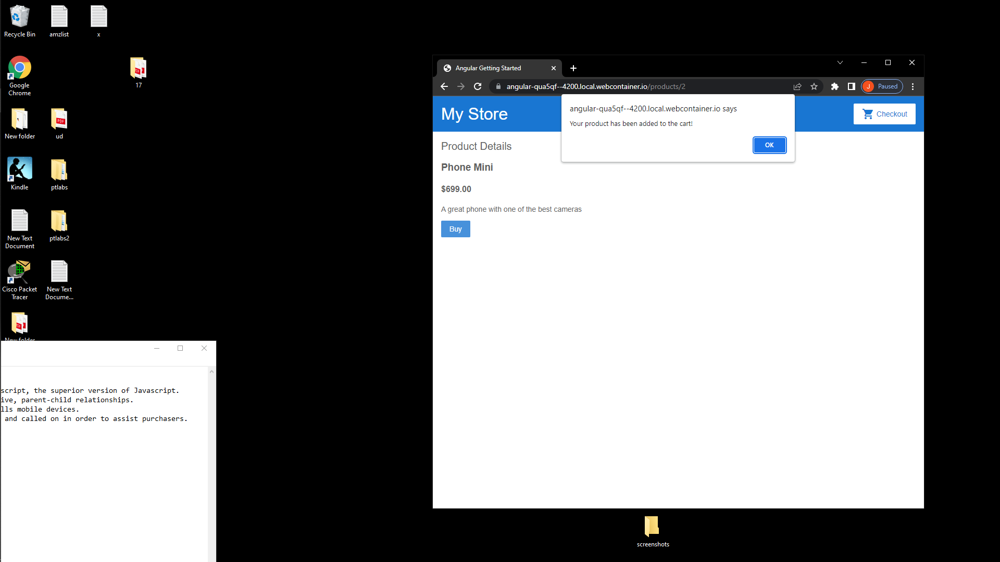
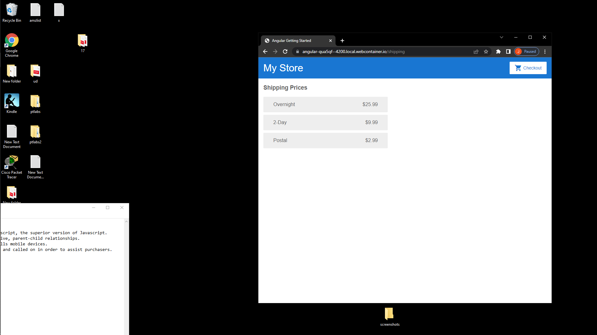
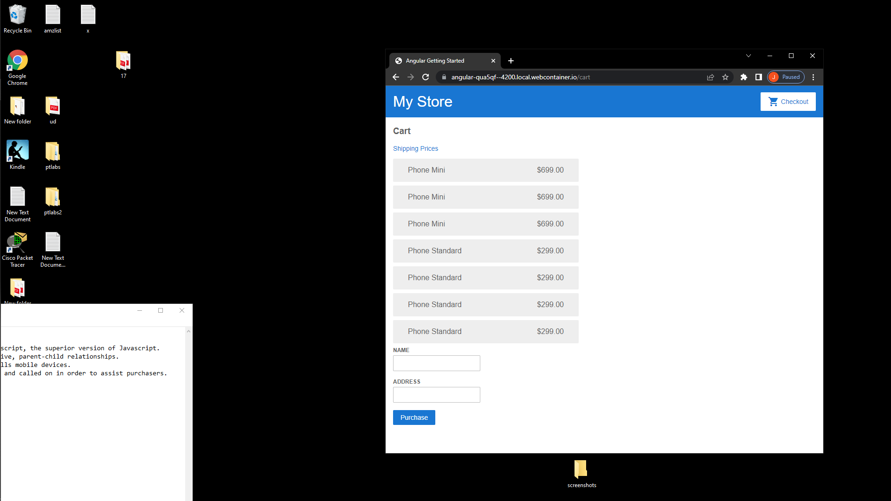

https://angular.io/start

[Edit on StackBlitz ⚡️](https://stackblitz.com/edit/angular-qua5qf)

Angular is a free way to build web applications and uses Typescript, the superior version of Javascript.
Components make up a whole and exchange data through interactive, parent-child relationships.
This is an introduction to Angular, a web application that sells mobile devices.
Components, such as alerts, shipping, and details, are routed and called on in order sell a product.

